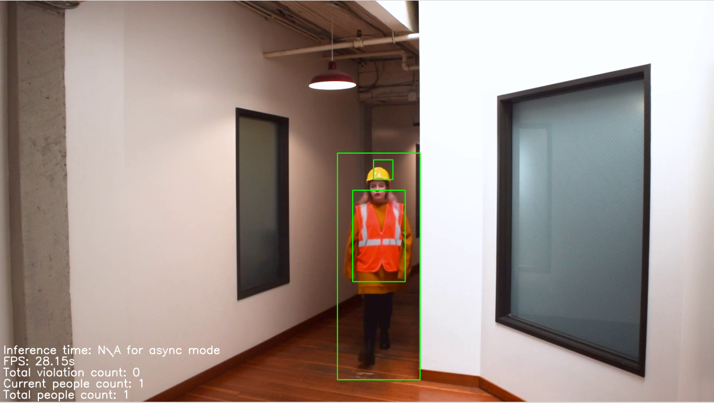
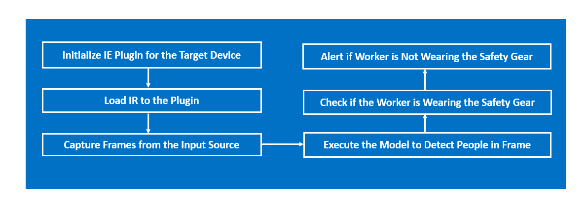

# Safety Gear Detector

| Details           |              |
|-----------------------|---------------|
| Target OS:            |  Ubuntu\* 16.04 LTS   |
| Programming Language: |  Python\* 3.5|
| Time to Complete:    |  30-40min     |




## What It Does
This reference implementation is capable of detecting people passing in front of a camera and detecting if the people are wearing safety-jackets and hard-hats. The application counts the number of people who are violating the safety gear standards and the total number of people detected.

## Requirements

### Hardware

- 6th to 8th Generation Intel® Core™ processors with Iris® Pro graphics or Intel® HD Graphics

### Software

- [Ubuntu\* 16.04 LTS](http://releases.ubuntu.com/16.04/) <br>
  **Note**: We recommend using a 4.14+ Linux* kernel with this software. Run the following command to determine the kernel version:

    ```
    uname -a
    ```

- OpenCL™ Runtime Package

- Intel® Distribution of OpenVINO™ toolkit 2019 R2 Release

## How It Works
The application uses the Inference Engine included in the Intel® Distribution of OpenVINO™ toolkit.

Firstly, a trained neural network detects people in the frame and displays a green colored bounding box over them. For each person detected, the application determines if they are wearing a safety-jacket and hard-hat. If they are not, an alert is registered with the system.



## Setup

### Install Intel® Distribution of OpenVINO™ toolkit
Refer to [Install the Intel® Distribution of OpenVINO™ toolkit for Linux*](https://software.intel.com/en-us/articles/OpenVINO-Install-Linux) to install and set up the toolkit.

Install the OpenCL™ Runtime Package to run inference on the GPU. It is not mandatory for CPU inference.

### Other dependencies
#### FFmpeg* 
FFmpeg is a free and open-source project capable of recording, converting and streaming digital audio and video in various formats. It can be used to do most of our multimedia tasks quickly and easily say, audio compression, audio/video format conversion, extract images from a video and a lot more.

## Setup
### Get the code
Clone the reference implementation
```
sudo apt-get update && sudo apt-get install git
git clone https://github.com/intel-iot-devkit/safety-gear-detector-python.git
```

### Install OpenVINO

Refer to [Install Intel® Distribution of OpenVINO™ toolkit for Linux*](https://software.intel.com/en-us/articles/OpenVINO-Install-Linux) to learn how to install and configure the toolkit.

Install the OpenCL™ Runtime Package to run inference on the GPU, as shown in the instructions below. It is not mandatory for CPU inference.


## Which model to use

This application uses the [person-detection-retail-0013](https://docs.openvinotoolkit.org/2019_R2/_intel_models_person_detection_retail_0013_description_person_detection_retail_0013.html) Intel® model, that can be downloaded using the **model downloader**. The **model downloader** downloads the __.xml__ and __.bin__ files that will be used by the application.

The application also uses the **worker_safety_mobilenet** model, whose Caffe* model file are provided in the `resources/worker-safety-mobilenet` directory. These need to be passed through the model optimizer to generate the IR (the .xml and .bin files) that will be used by the application.

To download the models and install the dependencies of the application, run the below command in the `safety-gear-detector-cpp-with-worker-safety-model` directory:
```
./setup.sh
```

### The Config File

The _resources/config.json_ contains the path of video that will be used by the application as input.

For example:
   ```
   {
       "inputs": [
          {
              "video":"path_to_video/video1.mp4",
          }
       ]
   }
   ```

The `path/to/video` is the path to an input video file.

### Which Input Video to use

The application works with any input video. Sample videos are provided [here](https://github.com/intel-iot-devkit/sample-videos/).

For first-use, we recommend using the *Safety_Full_Hat_and_Vest.mp4* video which is present in the `resources/` directory.

For example:
   ```
   {
       "inputs": [
          {
              "video":"sample-videos/Safety_Full_Hat_and_Vest.mp4"
          },
          {
              "video":"sample-videos/Safety_Full_Hat_and_Vest.mp4"
          }
       ]
   }
   ```
If the user wants to use any other video, it can be used by providing the path in the config.json file.

### Using the Camera Stream instead of video

Replace `path/to/video` with the camera ID in the config.json file, where the ID is taken from the video device (the number **X** in /dev/video**X**).

On Ubuntu, to list all available video devices use the following command:

```
ls /dev/video*
```

For example, if the output of above command is __/dev/video0__, then config.json would be:

```
  {
     "inputs": [
        {
           "video":"0"
        }
     ]
   }
```

### Setup the Environment

Configure the environment to use the Intel® Distribution of OpenVINO™ toolkit by exporting environment variables:

```
source /opt/intel/openvino/bin/setupvars.sh
```

__Note__: This command needs to be executed only once in the terminal where the application will be executed. If the terminal is closed, the command needs to be executed again.

## Run the Application

Change the current directory to the git-cloned application code location on your system:
```
cd <path_to_the_safety-gear-detector-cpp-with-worker-safety-model_directory>/application
```

To see a list of the various options:
```
./safety_gear_detector.py -h
```
A user can specify what target device to run on by using the device command-line argument `-d`. If no target device is specified the application will run on the CPU by default.
To run with multiple devices use _-d MULTI:device1,device2_. For example: _-d MULTI:CPU,GPU_

### Run on the CPU

To run the application using **worker_safety_mobilenet** model, use the `-sm` flag followed by the path to the worker_safety_mobilenet.xml file, as follows:
```
./safety_gear_detector.py -d CPU -m /opt/intel/openvino/deployment_tools/open_model_zoo/tools/downloader/Retail/object_detection/pedestrian/rmnet_ssd/0013/dldt/FP32/person-detection-retail-0013.xml -sm ../resources/worker-safety-mobilenet/FP32/worker_safety_mobilenet.xml -e /opt/intel/openvino/deployment_tools/inference_engine/lib/intel64/libcpu_extension_avx2.so
```
If the worker_safety_mobilenet model is not provided as command-line argument, the application uses OpenCV to detect safety jacket and hard-hat. To run the application without using worker_safety_mobilenet model:
```
./safety_gear_detector.py -d CPU -m /opt/intel/openvino/deployment_tools/open_model_zoo/tools/downloader/Retail/object_detection/pedestrian/rmnet_ssd/0013/dldt/FP32/person-detection-retail-0013.xml -e /opt/intel/openvino/deployment_tools/inference_engine/lib/intel64/libcpu_extension_avx2.so
```
**Note:** By default, the application runs on async mode. To run the application on sync mode, use ```-f sync``` as command-line argument.

### Run on the Integrated GPU
* To run on the integrated Intel GPU with floating point precision 32 (FP32), use the `-d GPU` command-line argument:

    **FP32:** FP32 is single-precision floating-point arithmetic uses 32 bits to represent numbers. 8 bits for the magnitude and 23 bits for the precision. For more information, [click here](https://en.wikipedia.org/wiki/Single-precision_floating-point_format)
    
    ```
    ./safety_gear_detector.py -d GPU -m /opt/intel/openvino/deployment_tools/open_model_zoo/tools/downloader/Retail/object_detection/pedestrian/rmnet_ssd/0013/dldt/FP32/person-detection-retail-0013.xml -sm ../resources/worker-safety-mobilenet/FP32/worker_safety_mobilenet.xml
    ```
* To run on the integrated Intel® GPU with floating point precision 16 (FP16):

    **FP16:** FP16 is half-precision floating-point arithmetic uses 16 bits. 5 bits for the magnitude and 10 bits for the precision. For more information, [click here](https://en.wikipedia.org/wiki/Half-precision_floating-point_format)
    
    ```
    ./safety_gear_detector.py -d GPU -m /opt/intel/openvino/deployment_tools/open_model_zoo/tools/downloader/Retail/object_detection/pedestrian/rmnet_ssd/0013/dldt/FP16/person-detection-retail-0013.xml -sm ../resources/worker-safety-mobilenet/FP16/worker_safety_mobilenet.xml
    ```
<!--
### Run on the Intel® Neural Compute Stick
To run on the Intel® Neural Compute Stick, use the `-d MYRIAD` command-line argument:
```
./safety_gear_detector.py -d MYRIAD -m /opt/intel/openvino/deployment_tools/open_model_zoo/tools/downloader/Retail/object_detection/pedestrian/rmnet_ssd/0013/dldt/FP16/person-detection-retail-0013.xml -sm ../resources/worker-safety-mobilenet/FP16/worker_safety_mobilenet.xml
```
**Note:** The Intel® Neural Compute Stick can only run FP16 models. The model that is passed to the application, through the `-m <path_to_model>` command-line argument, must be of data type FP16.   
-->

### Run on the Intel® Movidius™ VPU
To run on the Intel® Movidius™ VPU, use the `-d HDDL` command-line argument:
```
./safety_gear_detector.py -m /opt/intel/openvino/deployment_tools/open_model_zoo/tools/downloader/Retail/object_detection/pedestrian/rmnet_ssd/0013/dldt/FP16/person-detection-retail-0013.xml -sm ../resources/worker-safety-mobilenet/FP16/worker_safety_mobilenet.xml -d HDDL
```
**Note:** The Intel® Movidius™ VPU can only run FP16 models. The model that is passed to the application through the `-m <path_to_model>` command-line argument must be of data type FP16.

<!-- ### Run on the FPGA

Before running the application on the FPGA,  program the AOCX (bitstream) file.
Use the setup_env.sh script from [fpga_support_files.tgz](http://registrationcenter-download.intel.com/akdlm/irc_nas/12954/fpga_support_files.tgz) to set the environment variables.<br>
For example:

```
source /home/<user>/Downloads/fpga_support_files/setup_env.sh
```

The bitstreams for HDDL-F can be found under the `/opt/intel/openvino/bitstreams/a10_vision_design_bitstreams` folder.<br><br>To program the bitstream use the below command:<br>
```
aocl program acl0 /opt/intel/openvino/bitstreams/a10_vision_design_bitstreams/2019R1_PL1_FP11_RMNet.aocx
```

For more information on programming the bitstreams, please refer to https://software.intel.com/en-us/articles/OpenVINO-Install-Linux-FPGA#inpage-nav-11

To run the application on the FPGA with floating point precision 16 (FP16) use the `-d HETERO:FPGA,CPU` command-line argument:
```
./safety_gear_detector.py -m /opt/intel/openvino/deployment_tools/open_model_zoo/tools/downloader/Retail/object_detection/pedestrian/rmnet_ssd/0013/dldt/FP16/person-detection-retail-0013.xml -sm resources/worker-safety-mobilenet/FP16/worker_safety_mobilenet.xml -d HETERO:FPGA,CPU -e /opt/intel/openvino/deployment_tools/inference_engine/lib/intel64/libcpu_extension_avx2.so
```
 -->
